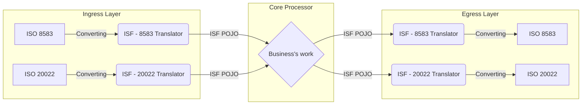

# Internal Standard Format (ISF) for financial messaging - Architectural Design

## 1. The Philosophical Foundation
The core philosophy behind the ISF (Internal Standard Format) is **infinite extensibility and future-proofing**. Instead of building a rigid, concrete implementation tied to today's standards (like ISO 8583 or ISO 20022), the ISF is designed as a philosophical construct—an ontology of a financial transaction. Simply speaking, should a new standard emerges or you decide to make one for your internal usage, integration with the other standards is simple and straightforward.

### Key ideas:
* **Empowering the Business Analyst (BA):** It is not the engineer's job to hardcode concrete routing configurations. The ISF acts as a toolkit. It provides a structurally sound, highly abstract framework that BA teams use to define actual implementations via explicit mapping dialects.
* **Hub-and-Spoke Integration:** By forcing all external dialects to normalize into the ISF at the system boundaries (Ingress), the core switch operates entirely independent of external formats. This solves the N x N point-to-point translation nightmare.
* **Agnosticism to Evolution:** If a new global standard supersedes ISO 20022, or a proprietary e-wallet API is onboarded, the core switch code remains untouched. Only a new ingress/egress mapping dialect is required.

---
**Overall Architecture Overview**

The system utilizes a decoupled Hub-and-Spoke architecture. All incoming messages are immediately translated into the ISF envelope, routed through the core system agnostically, and then translated back out to the destination's required format.




## 2. The Envelope Wrapper Pattern (3 parts structure)
To balance the highest level of abstraction with the absolute specificity required by financial systems, the ISF is divided into three distinct tiers. This is known as the Envelope Wrapper Pattern.

### Part 1: Internal Data (The Envelope)
This tier consists of strictly internal operational metadata. It is the data that only the local system uses to routing or do whatever you need. For example, should it be a JPOS system, the transaction manager just needs to look at this.
* **Purpose:** Decouples internal system routing from financial data. If the financial data structure is completely overhauled, the routing engine remains unaffected.
* **Proposed Components:** 
    * `Internal Type`: Classification of the transaction (e.g., Transfer, Network Management, Echo).
    * `Flow Direction`: Originating vs. Return/Response.
    * `Routing Information`: Source network/institute and Destination network/institute.
    * `Trace / Idempotency Key`: A globally unique identifier (UUID) used to safely manage retries/reversal, which can be passed into an in-memory cache like Redis.


### Part 2: Common Data (The Canonical Body)
This is the normalized financial payload. Essentially, this part is comprised of the necessary information for the type classified in the first part, regardless of the concrete original-destination standard.
* **Purpose:** Represents the universal truth of the financial message.
* **Proposed Components:** (For the money transferring transaction for example)
    * `Source Institute` & `Destination Institute`
    * `Source Account` & `Destination Account`
    * `Monetary Value` & `Currency` 
    * `Timestamp`: Standardized system time.
    * `Transaction Content / Purpose`: Remittance information.

### Part 3: Original Payload (The Archive)
This tier holds the raw message exactly as it arrived (e.g., the original `ISOMsg` object or the raw ISO 20022 XML String). Or you can put whatever suitable data format for your system here. 
* **Purpose:** 
    * **The Fast-Path Bypass:** If an ISO 8583 message routes to another ISO 8583 egress, the system skips deep translation and simply forwards the original payload.
    * **Cryptographic Verification:** Necessary for Message Authentication Code (MAC) hashing via Hardware Security Modules (HSMs), which require the exact original byte array.
    * **Audit Logging:** Ensures the switch has a pristine record of the partner's exact intent for dispute resolution.

---
## 4. Configuration Directory Structure

To maintain the separation of concerns, the ISF schemas, translation dialects, and routing rules are strictly segregated in the file system. This ensures backward compatibility via versioning and prevents configuration overlap.

```
/config
├── data/
│   ├── ISF/
│   │   ├── legacy_versions/
│   │   │   └── ver_01/
│   │   │       ├── ISF_config.txt
│   │   │       ├── common_data/
│   │   │       └── internal_data/
│   │   └── live_version/
│   │       ├── ISF_config.txt
│   │       ├── common_data/
│   │       └── internal_data/
│   └── translation/
│       ├── ISF_20022/
│       │   ├── ISF_20022_map_default.txt
│       │   └── custom_dialects/
│       │       ├── ISF_20022_map_dialect_1.txt
│       │       └── ISF_20022_map_dialect_2.txt
│       └── ISF_8583/
│           ├── ISF_8583_map_default.txt
│           └── custom_dialects/
│               ├── ISF_8583_map_dialect_1.txt
│               └── ISF_8583_map_dialect_2.txt
└── partner/
    ├── routing.txt
    └── configuration/
        ├── 20022_egress/
        │   ├── bankA.txt
        │   └── bankB.txt
        └── 8583_egress/
            ├── bank1.txt
            └── bank2.txt
```
---
## 5. Disclaimer
1.  As this was developed by an IT guy, the proposed model only serves as a philosophy and a toolkit, while concrete and specific implementation should be left to the BA team to develop.
2. This thing was developed for use in a financial switch, specifically in the ACH department. But its usage, as a tool for translation of ISO 8583 and ISO 20022 for interoperability between different financial message formats can be applied for commercial banks too.
3. The thing is originally made to be used with JPOS and by extension Java, but the ideas are agnostic to technology: one can implement this in whatever one is used to.
4. Loss of data between conversions is inevitable. There will be fields existing in one standard but not in another. This will be handled by passing in default values, but the more important information is preserved (by the engineering of part 2).
